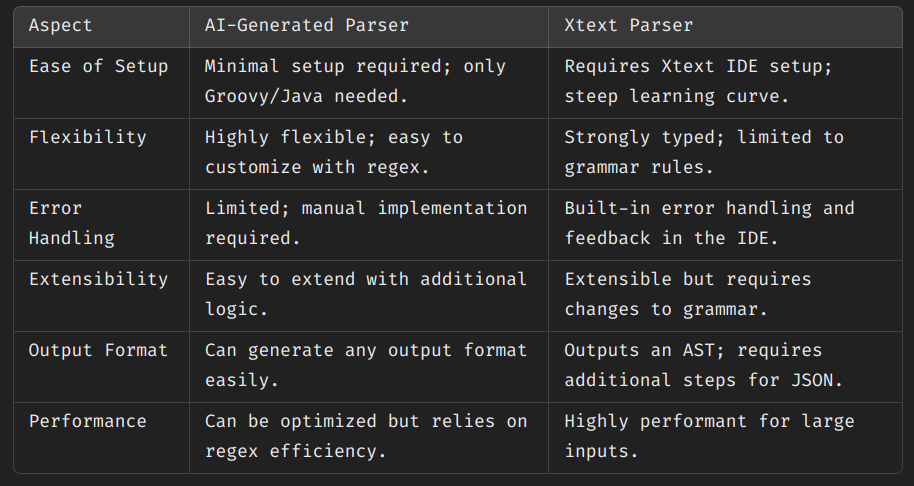

# Critical analysis

## Functionalities of DSL

1. Automation of Bucket Creation and Management

The DSL generates executable configuration files (e.g., JSON, YAML) or Groovy scripts that can be used to provision and manage cloud storage.

2. Support for Common Storage Operations

Includes functionalities for uploading files, setting permissions, managing lifecycle policies, and enabling versioning.

3. Integration with different cloud services

The DSL can integrate with cloud providers like AWS, Azure, or GCP by producing provider-specific configurations or command-line scripts.

## Limitations of DSL

1. Limited flexibility:

Advanced customizations requiring provider-specific APIs or intricate scripting may fall outside the DSL's capabilities.

2. Scalability challenges.

The DSL might struggle with managing complex configurations for very large-scale systems involving hundreds of buckets or intricate cross-service dependencies.

3. Tooling limitations

Users depend on Xtext tooling or equivalent for editor support, syntax highlighting, and validation. Issues in the tooling pipeline can hinder productivity.

## Comparing the AI generated and Xtext generated DSL

- How flexible are AI tools for generating parsers compared to Xtext for building parsers from DSLs?

